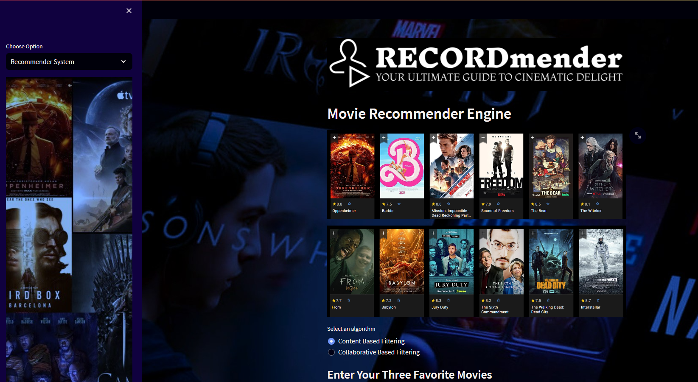

# Streamlit-based Recommender System

#### Description of contents

Below is a high-level description of the contents within this repo:

| File Name                             | Description                                                       |
| :------------------------------------ | :---------------------------------------------------------------- |
| `edsa_recommender.py`                 | Base Streamlit application definition.                            |
| `recommenders/collaborative_based.py` | Simple implementation of collaborative filtering.                 |
| `recommenders/content_based.py`       | Simple implementation of content-based filtering.                 |
| `resources/data/`                     | Sample movie and rating data used to demonstrate app functioning. |
| `resources/models/`                   | Folder to store model and data binaries if produced.              |
| `utils/`                              | Folder to store additional helper functions for the Streamlit app |

## Usage Instructions

#### Running the recommender system locally

As a first step to becoming familiar with our web app's functioning, we recommend setting up a running instance on your own local machine.

To do this, follow the steps below by running the given commands within a Git bash (Windows), or terminal (Mac/Linux):

1.  Ensure that you have the prerequisite Python libraries installed on your local machine:

```bash
pip install -U streamlit numpy pandas scikit-learn
conda install -c conda-forge scikit-surprise
```

2.  Clone the _forked_ repo to your local machine.

```bash
git clone https://github.com/{your-account-name}/unsupervised-predict-streamlit-template.git
```

3.  Navigate to the base of the cloned repo, and start the Streamlit app.

```bash
cd unsupervised-predict-streamlit-template/
streamlit run edsa_recommender.py
```

If the web server was able to initialise successfully, the following message should be displayed within your bash/terminal session:

```
  You can now view your Streamlit app in your browser.

    Local URL: http://localhost:8501
    Network URL: http://192.168.43.41:8501
```

You should also be automatically directed to the base page of your web app. This should look something like:



Congratulations! You've now officially deployed your web-based recommender engine!
